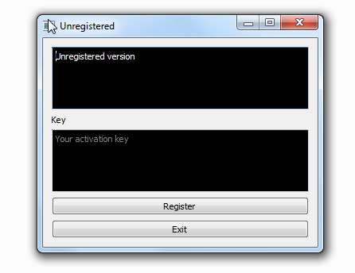

# Qt_VMProtect_WebLM
 
Qt Gui application template using VMProtect **Web License Manager**.

## TODO

- [x] Activation window

- [ ] Configuring Web License Manager && ModSecurity

## Setup

1. Edit `QSettings settings` in main.cpp, activationform.cpp

2. Add __forceinline or VMProtect macro.

3. Debug in `Ida Pro`

## Screen
